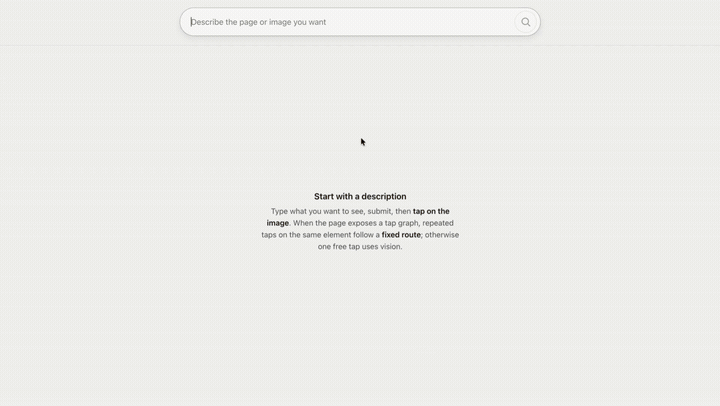

# Generative UI Browser

Most apps: **fixed frame**, AI in **patches**—still mostly hunt controls and scroll pages.

**Generative UI**: **new surface per decision**—a **whole view** (layout, imagery) for the moment, not smarter chrome. Harder for models; better when you want a **felt picture**, not links.

**What’s here** — end-to-end **search → image → tap → next image**; retrieval, compile, image, vision; runs in **`generative-ui-browser/`** (Node + React; Gemini / OpenAI or stubs).

## Demo

Preview (~18s, silent GIF). **Full demo with audio:** [demo.mp4](./generative-ui-browser/docs/demo.mp4) — open or download from the repo.

**Tradeoff, said plainly:** link lists still win for **exact answers and provenance**. This shape shines when **“show me”** beats **“tell me in paragraphs.”**

→ **[Install, run, and configure](./generative-ui-browser/README.md)**

## License

Add a `LICENSE` file when you’re ready to declare terms; none ships here by default.
